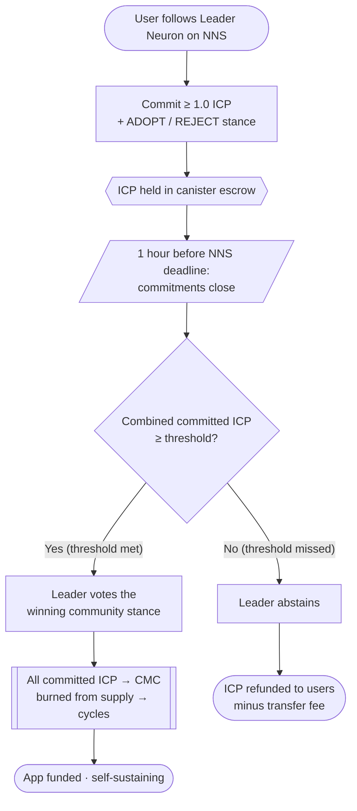
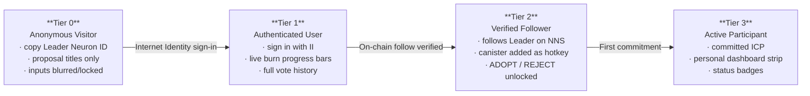
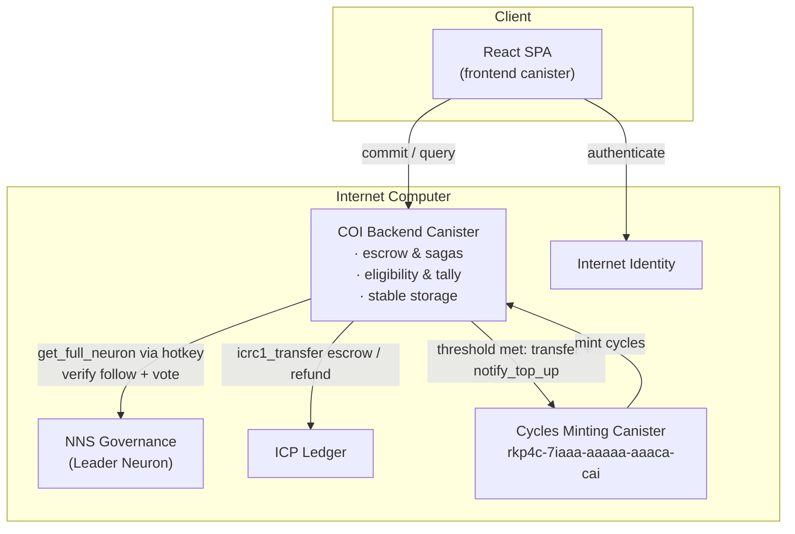

# Cycles of Influence (COI) — ICP Vote Delegation DAO App

**Cycles of Influence (COI)** is a decentralized governance participation
application built on the Internet Computer Protocol (ICP). It introduces **skin
in the game** to liquid democracy by combining neuron voting delegation with a
conviction-based token burning mechanism.

### 🔥 Live app: **https://kyclk-5qaaa-aaaap-quthq-cai.icp0.io/**

Running fully on-chain on the Internet Computer. Sign in with Internet Identity
to participate.

---

## 1. Core Concept & Mechanics

In traditional liquid democracy, users delegate their voting power to a trusted entity (the Leader Neuron) by selecting it as a followee in the Network Nervous System (NNS). However, followers have no direct way to signal conviction on specific proposals, nor can they prevent the Leader from voting without community alignment.

**Cycles of Influence** solves this via a trustless canister-based escrow:
* **Follow the Leader:** Users follow the primary Leader Neuron on the NNS Dapp.
* **Commit & Vote Stance:** For any active NNS proposal, users commit a chosen amount of liquid ICP (minimum **1.0 ICP**) to be burned and select their vote stance: **ADOPT** or **REJECT**.
* **1-Hour NNS Cutoff:** The canister closes all commitments exactly **1 hour** before the proposal's official NNS deadline.
* **Weighted Tally & Threshold Execution:**
  - Votes are weighted by the amount of ICP committed to the burn ($10^8$ votes per 1.0 ICP).
  - The canister checks the combined committed ICP ($B_{\text{adopt}} + B_{\text{reject}}$) against an initial flat threshold of **250 ICP**.
  - **Case A: Threshold Met $\ge$ 250 ICP:** The Leader Neuron automatically votes with the winning community choice (majority of committed ICP). **All committed ICP in both pots (Adopt and Reject) is sent to the Cycles Minting Canister (CMC)** — burned from the ICP supply and converted to canister cycles that fund this application's operation indefinitely. Your conviction powers the infrastructure.
  - **Case B: Threshold Failed < 250 ICP:** The Leader Neuron **abstains** from voting, and **all committed ICP is refunded** to the users (minus the 0.0001 ICP refund transfer fee).
* **Self-Sustaining by Design:** Governance activity directly funds the canister. Every successful threshold converts committed ICP into cycles, making the app increasingly self-sufficient the more it is used. The 0.005 ICP protocol fee on deposit covers treasury overhead; the remaining committed ICP either becomes cycles (threshold met) or is returned (threshold missed).

### Commitment & Settlement Flow

---

## 2. Dynamic User Experience & Progressive Disclosure

To prevent user overwhelm, the Single-Page Application (SPA) uses **progressive disclosure** to expand the user interface in-place as the user completes authentication and authorization gates:

1. **Tier 0 — Anonymous Visitor:** Can copy the Leader Neuron ID and view the list of active proposals (titles only). All commitment inputs and vote logs are hidden behind a blurred lock overlay.
2. **Tier 1 — Authenticated User:** signs in via **Internet Identity (II)**. Unlocks detailed proposal cards showing live burn progress bars and the Leader Neuron's complete historical vote log.
3. **Tier 2 — Verified Follower:** Triggers when the canister verifies on-chain that the user follows the Leader Neuron. To simplify this onboarding, a **Guided Walkthrough Modal** guides the user through copy-pasting the Leader Neuron ID to follow in NNS, and copying/pasting the App Canister Principal as a neuron hotkey (which authorizes on-chain follow verification). This unlocks the "Commit ADOPT/REJECT" inputs.
4. **Tier 3 — Active Participant:** Triggers once the user has committed ICP to at least one proposal. Displays a sticky **Personal Dashboard Strip** showing their total committed escrow, total ICP converted to cycles to date, and active proposal status badges.

### Progressive Disclosure Tiers

---

## 3. Project Directory Structure

* **[src/](file:///Users/andrejones/Desktop/workspace/projects/proof-of-burn/src)** — Backend and frontend source code.
* **[docs/](file:///Users/andrejones/Desktop/workspace/projects/proof-of-burn/docs)** — Deployment, mainnet, operations, configurations, and security runbooks.
* **[scripts/](file:///Users/andrejones/Desktop/workspace/projects/proof-of-burn/scripts)** — Monitoring and developer helper scripts.

---

## 4. Technical Feasibility & Architecture Highlights

* **Canister Hotkey Pattern:** Because follow configuration is private on the NNS Governance canister, our App Canister is added as a hotkey to the user's neuron. This allows our canister to securely query `get_full_neuron` to verify follow status and controller principal matches.
* **Burn-to-Cycles Settlement:** When a proposal threshold is met, committed ICP is transferred to the Cycles Minting Canister (`rkp4c-7iaaa-aaaaa-aaaca-cai`) via `icrc1_transfer`, then `notify_top_up` is called to mint cycles credited to the backend canister. The ICP is burned from the ledger supply — the same net effect as a direct burn — but the value is captured as computation fuel rather than destroyed outright. This makes the governance app self-sustaining: the more proposals pass threshold, the longer the canister runs without external top-up.

### System Architecture

