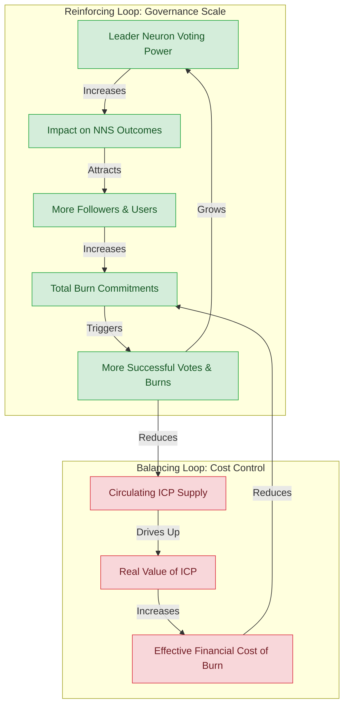
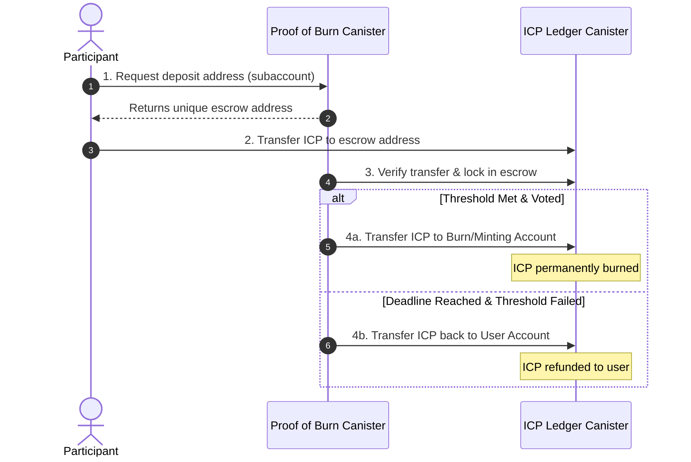

---
tags:
  - specification
  - mechanism
  - systems-thinking
  - tokenomics
created: 2026-06-06
status: active
---

# Core Mechanism & Systems Thinking

This document explores the economic, game-theoretic, and architectural feedback loops of the **Proof of Burn** application. By applying systems thinking, we analyze how the platform aligns incentives, manages risk, and coordinates voting power.

---

## 1. The Proof of Burn System Loop

The application acts as a decentralized coordination engine. It translates liquid financial sacrifice (burning tokens) into aggregated governance power.

### Reinforcing & Balancing Feedback Loops

1. **Governance Scale (Reinforcing Loop - $R_1$):** As the primary Leader Neuron accumulates more followers, its total voting power grows. As its voting power grows, its ability to influence NNS decisions increases, making the Proof of Burn platform a more attractive destination for governance advocates. This drives more users, more burn commitments, and further increases voting power.
2. **Cost Control (Balancing Loop - $B_1$):** When proposals hit the burn threshold, ICP is permanently destroyed. This reduces the circulating supply of ICP, driving up the market value of the remaining tokens. As ICP becomes more valuable, the opportunity cost of burning it increases, naturally slowing down low-conviction burns and preventing runaway inflation of the burn thresholds.

---

## 2. Staking-Based Burn Cap (Conviction vs. Capital)

To prevent a wealthy external actor (a "speculator" who owns liquid ICP but has no long-term stake in the network) from burning tokens to manipulate the Leader Neuron's vote, the system enforces a **Staking-Based Burn Cap**:

$$\text{User Max Burn Commitment} \le \text{User Staked Neuron Balance}$$

### Systems Thinking Rationale:
* **Decoupling Hazard:** If anyone could burn unlimited ICP to trigger a vote, the Leader Neuron's voting power could be hijacked by short-term speculators.
* **Alignment of Interests:** By capping the burn commitment at the user's NNS staked balance (`cached_neuron_stake_e8s`), we ensure that the power to direct the Leader Neuron is proportional to the user's long-term lockup in the ecosystem. You must have "skin in the game" (staked neurons) to earn the right to burn liquid tokens for governance influence.

---

## 3. Escrow Canister Design (Trustless Safety)

To ensure users that their funds are safe and will *only* be burned if the threshold is met, the system utilizes a canister-based escrow mechanism.

### Escrow Rules:
* **Unique Subaccounts:** The canister generates a unique ledger subaccount for each user and proposal. This keeps user balances isolated and easily auditable on-chain.
* **Deadline Enforcement:** The canister uses internal timers to check if the threshold is met before the NNS voting window closes.
* **Immutable Code — No Custodial Risk:** The canister's WebAssembly code is frozen at deployment by removing all controllers (black-holed). No administrator can upgrade the code, alter the rules, or withdraw escrowed funds. The canister logic is the final and complete law of the system.
* **One Commitment Per User Per Proposal:** Each authenticated user (Internet Identity principal) may commit to a proposal exactly once. The stance (ADOPT or REJECT) and amount are permanently recorded at submission. There is no mechanism to change or cancel a commitment.
* **Protocol Fee:** Every commitment incurs a flat **0.005 ICP protocol fee**, charged at submission time regardless of whether the proposal reaches threshold. The fee is non-refundable — it is the cost of participation. Fees are routed to the canister's treasury subaccount and automatically converted to cycles to sustain canister operation indefinitely.
* **Fee Sustainability Model:** With 250 regular participants each voting on ~100 proposals per year, the protocol collects approximately **125 ICP/year** in fees. Canister operating costs (inter-canister calls, storage, timers) are estimated at under **0.1 XDR/year** (~$0.10). The fee structure is intentionally conservative — the surplus cycles become a permanent insurance reserve for the immutable canister.
* **User-Paid Transaction Fees:** The user also covers all ledger transfer fees (0.0001 ICP per transfer, three transfers total). To commit a target burn amount (e.g., 5.0 ICP), the user must send exactly `target + 0.0053` ICP:
  - **0.0050 ICP** — protocol fee (routed to treasury)
  - **0.0001 ICP** — incoming ledger transfer fee (user → escrow subaccount)
  - **0.0001 ICP** — outgoing transfer fee reserve (for burn or refund)
  - **0.0001 ICP** — protocol fee transfer fee (escrow subaccount → treasury)
  - This ensures the canister operates with no developer subsidy.
* **Minimum Burn Commitment:** The minimum target burn amount is **1.0 ICP**, requiring a total deposit of **1.0053 ICP** (target + all fee overhead).

---

## 4. Community Vote & Stance Model: Adopt vs. Reject Pots

The application implements a weighted, dual-pot voting stance system. Rather than having the Leader pre-determine the neuron's vote, the community directly steers the Leader Neuron's direction by committing ICP to their preferred stance.

### The Stance and Burn Dynamics

1. **Commit and Vote (Once, Irrevocably):** When committing ICP to a proposal, the user must choose their vote stance: **ADOPT** or **REJECT**. This is a one-time, irreversible action per proposal per user. The canister rejects any subsequent commitment attempt from the same principal on the same proposal.
2. **The 1-Hour NNS Cutoff:** The canister closes all voting and new commitments exactly **1 hour** before the proposal's official NNS deadline. This guarantees a secure window for the canister to tally votes, execute the transaction, and submit the on-chain vote to the NNS.
3. **Weighting & Tallying:** The community decision is determined by a weighted count:
   - One vote is cast for every e8 of ICP committed to a pot (1.0 ICP = $10^8$ votes).
   - The canister compares the total committed ICP for ADOPT ($B_{\text{adopt}}$) against REJECT ($B_{\text{reject}}$).
4. **Execution Rules:**
   - **Case A: Threshold Met ($B_{\text{adopt}} + B_{\text{reject}} \ge 250\text{ ICP}$)**
     - The system enforces an initial flat-rate proposal burn threshold of **250 ICP** collectively committed by the community.
     - The Leader Neuron votes in accordance with the winning choice (whichever pot has the higher total committed ICP).
     - **All committed ICP in both pots (Adopt and Reject) is permanently burned.** This ensures true skin-in-the-game conviction and prevents risk-free hedging.
   - **Case B: Threshold Failed ($B_{\text{adopt}} + B_{\text{reject}} < 250\text{ ICP}$)**
     - The Leader Neuron **abstains** from voting.
     - **All committed ICP is refunded** to the users (minus the 0.0001 ICP refund transfer fee).
