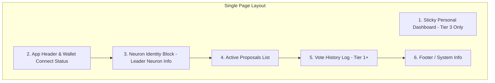

---
tags:
  - specification
  - ui-ux
  - component-inventory
  - progressive-disclosure
created: 2026-06-06
status: active
---

# UI Component & Tier Map

This document outlines the visual structure, layout, and behaviors of the **Proof of Burn** Single-Page Application (SPA). It maps how the interface dynamically expands in-place across the four eligibility tiers using progressive disclosure, inventories the UI components, provides annotated wireframes, and details key interactions.

---

## 1. Information Architecture (IA)

The entire application exists on a single scrollable page. The layout dynamically shifts and reveals content based on the user's tier.



---

## 2. Progressive Disclosure Map

The application transitions in-place as the user unlocks permission levels. 

```mermaid
stateDiagram-v2
    [*] --> Tier0 : Visit Site (Anonymous)
    
    state Tier0 {
        note right of Tier0: - Leader Neuron ID (Copy)<br/>- Active Proposals (Titles only)<br/>- "Connect Wallet" CTA
    }

    Tier0 --> Tier1 : User Signs In via Internet Identity (II)
    
    state Tier1 {
        note right of Tier1: - Header shows II principal<br/>- Unlocks Vote History Log<br/>- Proposal Cards show burn progress bars<br/>- Prompt to Follow Leader Neuron
    }

    Tier1 --> Tier2 : Canister confirms user is following
    
    state Tier2 {
        note right of Tier2: - Unlocks "Commit to Burn" input<br/>- Shows user's neuron stake context
    }

    Tier2 --> Tier3 : User commits ICP to >=1 proposal
    
    state Tier3 {
        note right of Tier3: - Unlocks Personal Dashboard Strip (Sticky)<br/>- Shows per-proposal commit badges
    }
```

---

## 3. Annotated Wireframes (ASCII Layouts)

### Desktop View (Tier 3 - Fully Unlocked)

```text
+-----------------------------------------------------------------------------------+
|  [Tier 3 Personal Dashboard]  Committed: 12.0 ICP | Burned: 45.5 ICP | Joined: 8  |
+-----------------------------------------------------------------------------------+
|  [Proof of Burn DAO]                              [Principal: ab12...9z - Connected] |
+-----------------------------------------------------------------------------------+
|  [Leader Neuron: 987654321] [Copy]  | Follow Status: [ Following (On-Chain) ]     |
+-----------------------------------------------------------------------------------+
|                                                                                   |
|  Active NNS Proposals                                                             |
|  +-----------------------------------------------------------------------------+  |
|  | Proposal #12345: Upgrade governance canister               [Status: ACTIVE] |  |
|  | Topic: System Canister Upgrades  |  Deadline: 02h : 15m : 10s               |  |
|  |                                                                             |  |
|  | Combined Burn: 142.5 / 250.0 ICP (Commitments close in 01h 15m)             |  |
|  | ADOPT Pot:  [===========================---------------] 130.0 ICP          |  |
|  | REJECT Pot: [==========--------------------------------] 12.5 ICP           |  |
|  |                                                                             |  |
|  | Commit Stance: [ 5.0    ] ICP   [ Commit to ADOPT ]   [ Commit to REJECT ]  |  |
|  | Total deposit: 5.0053 ICP (incl. 0.005 protocol fee + 0.0003 ledger fees)  |  |
|  | Your Commitment: [ 5.0 ICP Committed to ADOPT — Final ]                    |  |
|  +-----------------------------------------------------------------------------+  |
|                                                                                   |
|  Vote History                                                                     |
|  +-----------------------------------------------------------------------------+  |
|  | Proposal ID | Title                    | Outcome  | ICP Burned | Date       |  |
|  | #12300      | Register Node Provider   | ADOPTED  | 12.5 ICP   | 2026-06-01 |  |
|  | #12290      | Update NNS Config        | REJECTED | 0.0 ICP    | 2026-05-28 |  |
|  +-----------------------------------------------------------------------------+  |
+-----------------------------------------------------------------------------------+
```

### Mobile View (Tier 2 - Reflowed Stack)

```text
+-----------------------------------+
| [Proof of Burn]           [ab12...] |
+-----------------------------------+
| Leader Neuron: 987654321 [Copy]   |
| Status: [ Following ]             |
+-----------------------------------+
|                                   |
| ACTIVE PROPOSALS                  |
| +-------------------------------+ |
| | Proposal #12345               | |
| | Upgrade governance canister   | |
| | Topic: System | Exp: 02h 15m  | |
| |                               | |
| | Threshold: 142.5 / 250.0 ICP  | |
| | ADOPT:  130.0 ICP             | |
| | REJECT: 12.5 ICP              | |
| |                               | |
| | Commit Stance:                | |
| | [ 5.0    ] ICP                | |
| | [ Commit ADOPT ] [ Commit REJ ]| |
| | (Max commitment limit: 12 ICP) | |
| +-------------------------------+ |
|                                   |
| VOTE HISTORY                      |
| +-------------------------------+ |
| | #12300 | ADOPTED | 12.5 ICP   | |
| | #12290 | REJECTED| 0.0 ICP    | |
| +-------------------------------+ |
+-----------------------------------+
```

---

## 4. Component Inventory & States

### 1. Proposal Card
* **Default Fields:** ID, Title, Category Tag, Expiry Timer.
* **States & Visual Styles:**
  * `Locked (Tier 0)`: Main body blurred (back-drop filter: 4px). Hovering displays a lock shield overlay with text: *"Connect wallet to unlock."*
  * `Unlocked (Tier 1)`: Blur removed. Dual-pot progress indicators (ADOPT and REJECT) are visible and update live. Action buttons disabled (greyed out, 50% opacity). Hovering displays a tooltip: *"Follow our neuron in NNS to unlock voting."*
  * `Eligible (Tier 2)`: Burn amount input active. Dual buttons "Commit ADOPT" and "Commit REJECT" active. A warning label reads: *"Your commitment is final and cannot be changed."*
  * `Committed (Tier 3)`: The commit input and buttons are replaced by a locked conviction badge (e.g., *"Committed 5.0 ICP to ADOPT — Final"*). The badge is visually distinct (e.g., amber/gold border) to reinforce permanence. No further action is possible on this proposal for this user.
  * `Success/Voted`: Replaced with a resolved state. Displays: *"Neuron Voted [ADOPT/REJECT] — X.XX ICP Burned"* (total combined pot amounts burned).
  * `Expired`: Displays: *"Closed — Threshold not reached. Leader Neuron Abstained. Funds refunded."*

### 2. Neuron Identity Block
* **States:**
  * `Disconnected (Tier 0)`: Shows Neuron ID, a "Copy" button (copied confirmation feedback), and a link to the NNS dashboard.
  * `Verifying`: A circular progress spinner replaces the follow status badge.
  * `Verified`: Displays a green pill badge reading *"Following"*.

### 3. Vote History Log
* **States:**
  * `Gated (Tier 0)`: Table body is blurred and displays a text card: *"Sign in to view Leader Neuron voting history."*
  * `Visible (Tier 1+)`: Fully interactive tabular list with paginated history records.

### 4. Personal Dashboard Strip (Tier 3 Only)
* **Stats Shown:** 
  - `Committed Escrow`: Total ICP currently locked in pending proposals.
  - `Total Burned`: Historical sum of ICP successfully burned by the user.
  - `Proposals Joined`: Count of active/past proposals the user participated in.

---

## 5. Interaction & Transition Notes

1. **Internet Identity Sign-In Transition:** Authentication uses Internet Identity (II) exclusively — no wallet plugin required. Clicking "Connect" opens the II popup flow in a new window. On successful authentication, the page does not reload. The blur on the active proposals list and vote history log fades out smoothly (transition: backdrop-filter 300ms ease). The connect button morphs into the II principal pill (truncated, e.g., `ab12...9z`).
2. **Follower Onboarding Check (Guided Walkthrough Modal):** 
   - Once authenticated (Tier 1), the app triggers an on-chain follow check.
   - If the check succeeds, the user is automatically upgraded to Tier 2.
   - If the follow check fails (meaning they haven't followed the Leader or authorized the hotkey), a **Guided Onboarding Wizard Modal** opens automatically to guide them step-by-step:
     - **Tab 1: Follow the Leader.** Displays the **Leader Neuron ID** with a copy icon and visual screenshots/instructions showing where to paste it in the NNS Dapp. Includes a link to open NNS.
     - **Tab 2: Authorize Verification.** Displays the **App Canister Principal** with a copy icon and screenshots showing how to add it as a hotkey to their neuron.
     - **Tab 3: Verification.** Displays a "Verify Follow Status" button that triggers the on-chain query. While checking, a pulsing loader is shown. Upon success, a celebratory checkmark appears, the modal closes, and the UI unlocks.
3. **Commit ICP Action:**
   - When a user enters a target burn value (e.g., 5.0 ICP) and clicks "Commit ADOPT" or "Commit REJECT", a **confirmation modal** appears with a prominent irreversibility warning: *"This commitment is permanent and cannot be undone. Once submitted, your ICP will be locked until the proposal closes."*
   - The modal shows a clear fee breakdown:
     ```
     Conviction amount:   5.0000 ICP  (burned if threshold met, refunded if not)
     Protocol fee:        0.0050 ICP  (non-refundable, funds canister operation)
     Ledger fees:         0.0003 ICP  (3 × 0.0001 ICP ledger transfer fees)
     ─────────────────────────────────
     Total deposit:       5.0053 ICP
     ```
   - A note beneath the breakdown reads: *"The protocol fee is non-refundable regardless of outcome."*
   - The user must click a final **"Confirm — I Understand This Is Final"** button to proceed.
   - The canister checks that:
     - The target burn is ≥ the minimum commitment limit of 1.0 ICP.
     - The total deposit (`target + 0.0053` ICP) is ≤ the user's available liquid balance.
     - The target burn is ≤ the user's staked neuron balance (Staking-Based Burn Cap).
     - The user has **not already committed** to this proposal (one commitment per user per proposal).
   - If valid, the transaction executes, the modal shows a success checkmark, and the proposal card transitions to the `Committed` state — the input and buttons are permanently replaced by the locked conviction badge. No further commits on this proposal are possible from this identity.
4. **Threshold Achieved Celebration:** When the total committed ICP meets or exceeds the required threshold, the progress bar changes from warning orange to active green, and a particle-burst (celebration) animation occurs over the card to notify visitors.
