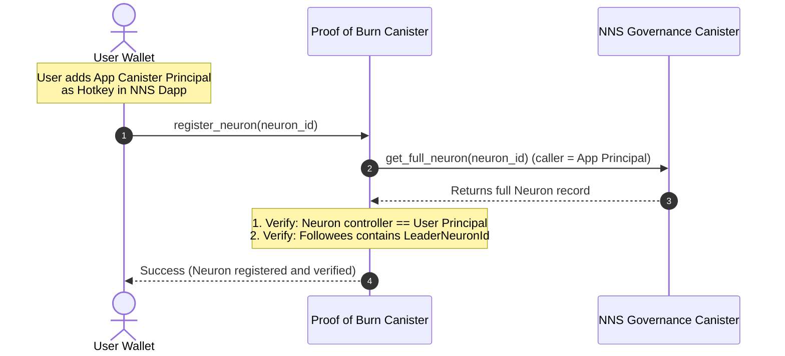

---
tags:
  - specification
  - technical
  - nns-integration
  - icp-ledger
created: 2026-06-06
status: active
---

# Technical Feasibility & NNS Integration

This document details the on-chain interaction models between the **Proof of Burn Canister**, the **NNS Governance Canister**, and the **ICP Ledger Canister**. It outlines the exact API structures, permission schemes, and transactions required to make the application function trustlessly.

---

## 1. Authentication: Internet Identity

The application uses **Internet Identity (II)** as its sole authentication standard. II is the native identity layer of the Internet Computer, requiring no third-party wallet or browser extension.

- The frontend integrates the `@dfinity/auth-client` library to initiate the II popup flow.
- On successful login, the app receives a **delegated identity** scoped to the app's canister origin.
- The user's **principal** (derived from their II anchor and the app origin) is used as their unique identifier in all canister calls.
- There is no Plug wallet, Stoic, or other wallet support in this version.

---

## 2. On-Chain Neuron Follow Verification

To participate in the burn-to-vote mechanism, the app must verify that a user controls a specific neuron and has configured that neuron to follow our primary Leader Neuron in the NNS.

### The Access Control Problem
The public `get_neuron_info` query on the NNS Governance Canister (`rrkah-fqaaa-aaaaa-aaaaq-cai`) returns basic metadata but **excludes** security-sensitive information, specifically the `controller`, `hot_keys`, and `followees` fields. 

### The Solution: Canister Hotkey Pattern
To resolve this securely:
1. **Add Hotkey:** The user goes to the NNS Dapp and registers our **Proof of Burn Canister Principal** as a hotkey on their neuron.
2. **Register ID:** The user submits their `NeuronId` to our canister.
3. **Query Full Details:** Our canister calls the `get_full_neuron` method on the NNS Governance Canister on behalf of the user. Because our canister is a registered hotkey, the NNS canister allows the call and returns the full `Neuron` record.
4. **Verify Ownership and Follow Status:**
   - **Ownership Check:** The canister verifies that the returned `controller` principal matches the user's authenticated wallet principal (preventing users from registering neurons they do not own).
   - **Follower Check:** The canister parses the returned `followees` vector:
     ```candid
     followees : vec record { int32; Followees };
     ```
     It verifies that our primary Leader Neuron ID is present in the `Followees` list for the targeted proposal topic(s) (e.g., Topic 1: Governance).



---

## 3. Canister-Driven Automatic Voting

When the community meets the burn threshold for a proposal, the Leader Neuron must vote. The Proof of Burn canister automates this action.

### Authorization
The owner of the Leader Neuron must add the **Proof of Burn Canister Principal** as a hotkey to the Leader Neuron. 

### Execution & Tallying Logic

1. **Cutoff Timer:** Exactly **1 hour** before the proposal's NNS deadline, the canister disables any new deposits or commitments for that proposal.
2. **Aggregating and Evaluating Threshold:**
   - The canister tallies the total ICP committed:
     $$B_{\text{total}} = B_{\text{adopt}} + B_{\text{reject}}$$
   - **Case A: Threshold Met ($B_{\text{total}} \ge 250\text{ ICP}$)**
     - The canister checks the majority pot: if $B_{\text{adopt}} > B_{\text{reject}}$, `VOTE_CHOICE` is set to `1` (Yes / Adopt). If $B_{\text{reject}} \ge B_{\text{adopt}}$, `VOTE_CHOICE` is set to `2` (No / Reject).
     - The canister executes an inter-canister call to the NNS Governance Canister's `manage_neuron` method:
       ```candid
       manage_neuron : (ManageNeuron) -> (ManageNeuronResponse);
       ```
       with the `RegisterVote` command:
       ```candid
       record {
         id = opt record { id = LEADER_NEURON_ID };
         command = opt variant {
           RegisterVote = record {
             proposal = opt record { id = PROPOSAL_ID };
             vote = VOTE_CHOICE; // 1 for Yes (Adopt), 2 for No (Reject)
           }
         };
         neuron_id_or_subaccount = null;
       }
       ```
     - The NNS canister records the vote.
   - **Case B: Threshold Fails ($B_{\text{total}} < 250\text{ ICP}$)**
     - The canister does **not** call `manage_neuron` (causing the Leader Neuron to abstain).
     - All committed funds are marked for refund.

---

## 4. Execution of the Burn Transaction

Escrowed funds are held inside unique subaccounts of the Proof of Burn Canister.

### The Ledger Interface
To burn the tokens, the canister uses the ICP Ledger Canister's ICRC-1 interface (`ryjl3-tyaaa-aaaaa-aaaba-cai`).

1. **Get Minting Account:** The canister queries the ledger's minting account via `icrc1_minting_account` (the Cycles Minting Canister (CMC) ledger account).
2. **Execute Transfer (Burn or Refund):**
   - **On Burn (Threshold Met):** The canister transfers the committed `target` amount to the minting account. The transaction fee of **0.0001 ICP** is deducted from the escrow subaccount's fee reserve, and the remaining target amount is transferred and burned.
   - **On Refund (Threshold Fails):** The canister transfers the target amount back to the user's principal. The transaction fee of **0.0001 ICP** is deducted from the escrow subaccount's fee reserve, returning exactly the target amount to the user.
   - **Method Interface:**
     ```candid
     icrc1_transfer : (TransferArgs) -> (variant { Ok : BlockIndex; Err : TransferError });
     ```
     By transferring the tokens to this minting account, they are formally removed from circulation, reducing the total token supply of the network.

---

## 5. Canister Governance: Code is Law

The Proof of Burn canister is designed to be **permanently immutable after launch**. This is a deliberate design choice to establish trust with users: the rules governing their funds cannot be changed by any party, including the original developer.

### Immutability Process

1. **Development & Audit Phase:** The canister is developed, tested on testnet, and optionally audited.
2. **Initial Deployment:** The canister is deployed to the ICP mainnet with the developer's principal as the sole controller.
3. **Black-Holing:** Immediately after launch validation, the developer removes all controllers from the canister (sets the controller list to empty, or transfers control to the well-known black-hole canister `e3mmv-5qaaa-aaaah-aadma-cai`). This action is irreversible on-chain.
4. **Post-Black-Hole State:** The canister can never be upgraded, stopped, or deleted. Its Wasm module is permanently frozen.

### Transparency

- The canister's source code is published publicly on GitHub before deployment.
- The deployed Wasm hash is verifiable on-chain via the IC management canister, allowing anyone to confirm the running code matches the published source.
- All canister state (proposals, commitments, burn history) is publicly queryable — no hidden admin views.

### Trade-offs and Acceptance Criteria

| Trade-off | Accepted? | Rationale |
|---|---|---|
| Bugs cannot be patched post-launch | Yes | Users must be able to trust the rules are immutable |
| Threshold (250 ICP) cannot be adjusted | Yes | Governance parameters are fixed at deploy time |
| New features require a separate canister | Yes | A v2 canister can be deployed alongside without affecting v1 |
| Cycles must be pre-funded sufficiently | Yes | The canister must be funded with enough cycles to run indefinitely without a top-up mechanism |

> [!WARNING]
> Because the canister cannot be upgraded, pre-deployment testing and auditing are critical. Once black-holed, any logic bug is permanent.

