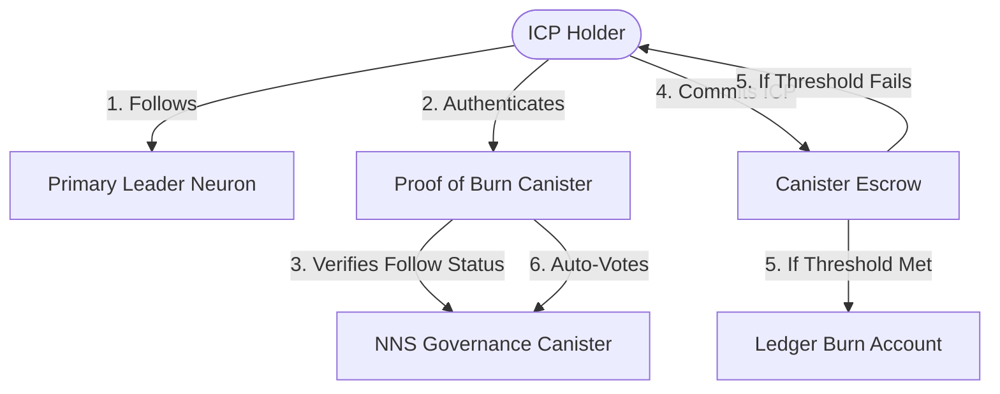

---
tags:
  - specification
  - index
  - proof-of-burn
created: 2026-06-06
status: active
---

# Proof of Burn — Specification Vault

Welcome to the official specification folder for the **Proof of Burn** DAO application on the Internet Computer Protocol (ICP). This vault is structured to provide high-level, easily digestible documentation for users, designers, and non-technical stakeholders, while addressing key system architecture decisions and research findings.

> [!NOTE]
> The primary goal of this application is to empower ICP holders to aggregate their voting power by following a primary neuron, and to coordinate its votes through a trustless **Proof of Burn** mechanism where they commit and burn ICP to signal their governance conviction.

---

## Specification Navigation Map (Logical Reading Order)

To explore the planned architecture and designs, select one of the following modules in order:

### 1. High-Level Overview
* **[[1. User & Stakeholder Overview]]**
  An introductory guide explaining the core value proposition, the user journey, and how the progressive disclosure interface makes Web3 governance accessible to everyone.

### 2. System Design & Dynamics
* **[[2. Core Mechanism & Systems Thinking]]**
  A systems thinking analysis of the proof of burn loop, the feedback loops in the economy, and the game-theoretic trade-offs between different voting pot models.

### 3. Interface & UX Architecture
* **[[3. UI Component & Tier Map]]**
  The component inventory and progressive disclosure map for our Single-Page Application (SPA), defining what users see at each eligibility tier.

### 4. Technical Verification & Feasibility
* **[[4. Technical Feasibility & NNS Integration]]**
  Research-backed documentation explaining how neuron following is verified on-chain (via Internet Identity + hotkey pattern), how the canister executes automatic votes, the native mechanics of burning ICP on the Ledger, and the immutable canister governance model.

### 5. Canister Architecture
* **[[5. Canister Architecture]]**
  The internal structure of the single Proof of Burn canister: stable data model (proposals, commitments, user neurons), subaccount derivation scheme, timer design (sync, cutoff, settle), the public Candid interface, and cycles budget guidance.

### 6. Error Handling Strategy
* **[[6. Error Handling Strategy]]**
  Complete failure taxonomy covering user input errors, deposit verification, ledger transfer failures (with mark-and-retry logic), NNS vote failures, timer misfires, and cycles exhaustion — including the stuck funds escalation path.

---

## System Overview at a Glance

